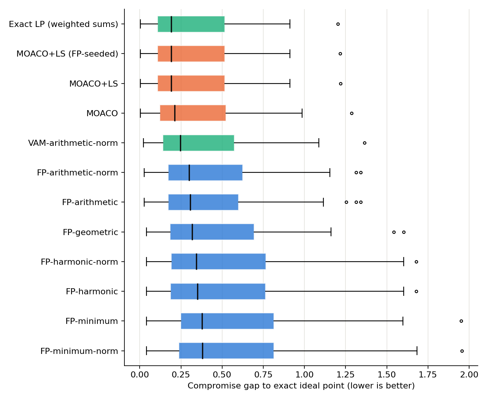
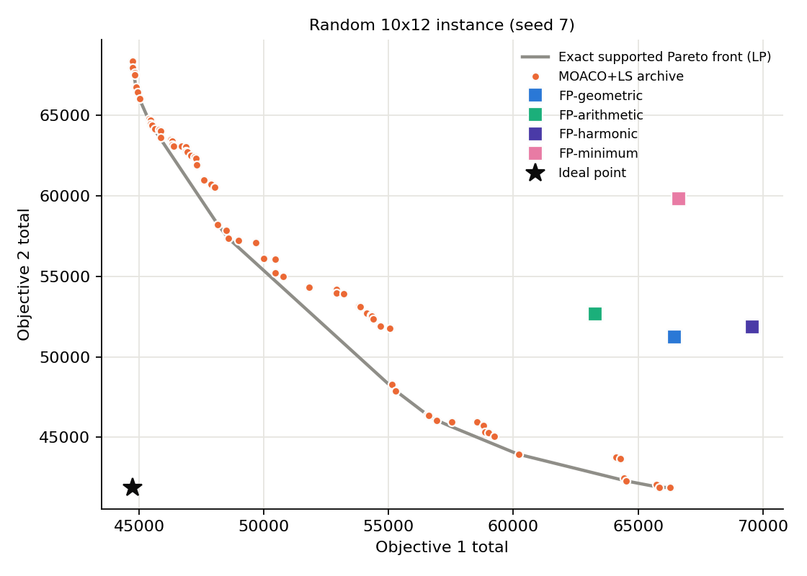

# Enhanced Ant Colony Algorithm for the Multi-Objective Transportation Problem

[](https://enhancedantcolonyalgorithm.streamlit.app/)


**Live demo: [enhancedantcolonyalgorithm.streamlit.app](https://enhancedantcolonyalgorithm.streamlit.app/)** — try the planner in your browser, no install needed.

**Enhanced Ant Colony Algorithm Incorporating Geometric Mean for Multi-Objective Transportation Challenges** — implementation, exact baselines, and a reproducible benchmark.

The **Multi-Objective Transportation Problem (MOTP)**: ship goods from *m* sources (supplies *aᵢ*) to *n* destinations (demands *bⱼ*) while minimising *K* objectives at once (e.g. cost, time, distance), each with its own cost matrix.

This repository contains:

| Component | Module | What it is |
|---|---|---|
| **Fixed-probability heuristic** (the source paper's method) | `motp/fixedprob.py` | Combine objectives → fixed "pheromone" probability matrix → Vogel-style penalties → greedy allocation. One implementation, pluggable combiner (geometric / arithmetic / harmonic / minimum / …). |
| **Classic VAM** | `motp.fixedprob.vam` | Vogel's Approximation Method on the combined matrix (penalties recomputed each step). |
| **MOACO** | `motp/aco.py` | A real multi-objective ant colony: per-objective pheromone, MAX–MIN bounds, evaporation, stochastic ants with spread weight vectors, Pareto archive, optional stepping-stone local search, optional seeding from the heuristic. |
| **Local search** | `motp/localsearch.py` | Budgeted stepping-stone / MODI pivots. |
| **Exact baselines** | `motp/exact.py` | Ideal point, payoff table, supported Pareto front (weighted-sum LPs), complete bi-objective front (ε-constraint MILP). |
| **Metrics** | `motp/metrics.py` | Non-dominated filter, exact hypervolume, compromise gap to the ideal point. |
| **Benchmark** | `experiments/run_benchmark.py` | Seeded instances, repeated runs, Friedman + Holm-corrected Wilcoxon tests, figures. |

## Demo app

**[Open the live app →](https://enhancedantcolonyalgorithm.streamlit.app/)**

An interactive planner built with Streamlit: load the sample data, generate a random instance, or upload your own CSVs, then compare the paper's method, VAM, the ant colony and the exact LP optimum on a trade-off chart, choose a plan by setting how much each objective matters, and download the shipping plan.

```bash
pip install -r requirements.txt
streamlit run app/streamlit_app.py
```


Unbalanced problems (total supply ≠ total demand) are balanced automatically with a zero-cost dummy source or destination.

**Deploying.** The app is live at <https://enhancedantcolonyalgorithm.streamlit.app/> on [Streamlit Community Cloud](https://share.streamlit.io) (free) and redeploys automatically on every push to `main`. To deploy your own copy: *Create app* → repository `LapaluLiyanage/ENHANCED_ANT_COLONY_ALGORITHM`, branch `main`, main file `app/streamlit_app.py`. Dependencies come from `requirements.txt`. Serverless hosts such as Vercel can't run Streamlit, because it needs a long-running server.

## Quick start

```bash
pip install -r requirements.txt
python -m pytest -q                              # 322 tests
python motp_geometric_fixedprob.py               # the paper's method on the 4x4 sample
python experiments/run_benchmark.py --quick      # ~1 min smoke benchmark
python experiments/run_benchmark.py              # full benchmark (~4 min on 2 cores)
```

### As a library

```python
from motp import MOTP, load_csvs, fixedprob, aco, exact, metrics
from motp.aco import ACOParams

p = load_csvs(["data/objective1.csv", "data/objective2.csv"])

# the source paper's method
r = fixedprob.run(p, combiner="geometric")
print(r.allocation, r.objective_totals)          # [1902, 1198]

# exact reference
ideal, nadir, payoff = exact.ideal_and_nadir(p)  # ideal = [1898, 1198]
print(exact.epsilon_constraint_front(p))         # complete Pareto front

# ant colony (returns a Pareto archive, not a single point)
res = aco.run(p, ACOParams(seed=0, ls_prob=0.1))
print(res.archive_objectives)
x, f = res.best_compromise(ideal)
```

Other options: `fixedprob.run(p, "arithmetic", weights=[0.7, 0.3], normalize="max")`, `dynamic_penalties=True`, random instances via `MOTP.random(m, n, k, correlation=0.5, seed=1)`, unbalanced problems via `MOTP.balanced(...)` (adds a dummy row/column).

### Old scripts still work

`motp_{geometric,arithmetic,harmonic,minimum}_fixedprob.py` are now thin wrappers around the package. `from motp_geometric_fixedprob import run_algorithm` returns the same dict keys as before, and `tests/test_motp.py` checks that the refactored code reproduces the **exact allocations of the original scripts** on the sample data and 40 random instances (168 recorded cases).

```bash
python motp_geometric_fixedprob.py data/objective1.csv data/objective2.csv
python motp_harmonic_fixedprob.py  data/objective1_new.csv data/objective2_new.csv data/objective3_new.csv
```

### CSV format

One CSV per objective, with a `Supply` column and a `Demand` row (supply/demand are read from the first file and must match in the rest):

```csv
"","D1","D2","D3","D4","Supply"
"S1","24","29","18","23","21"
...
"Demand","15","22","26","30",""
```

## How the fixed-probability method works

1. **Combine** the K matrices into C (geometric mean in the paper).
2. **Probability matrix** P = (max C − C) / Σ(max C − C).
3. **Penalties**: for each row/column, the gap between its two largest P values — computed **once** (static).
4. **Allocate**: take the line with the largest penalty (rows win ties), allocate min(supply, demand) to its highest-P cell, retire exhausted lines, repeat.

> **Important for the write-up.** P is a strictly decreasing *affine* function of C, so "highest P" = "lowest cost" and each P-penalty is exactly the Vogel penalty on C divided by a constant. The method is therefore **Vogel's Approximation Method on the combined matrix with penalties that are never updated**. With `dynamic_penalties=True` it becomes classic VAM (verified by `test_dynamic_fixedprob_equals_textbook_vam`). There is no pheromone update, randomness, or iteration — it is a deterministic constructive heuristic. `motp/aco.py` provides the genuine ACO machinery if the "ant colony" framing is to be kept.

## Findings on the sample data

For the 4×4 bi-objective sample (`data/objective1.csv`, `data/objective2.csv`), solved exactly:

| | Obj 1 | Obj 2 |
|---|---|---|
| Ideal point | 1898 | 1198 |
| Complete Pareto front (ε-constraint) | 1898 / 1900 / 1902 | 1212 / 1205 / 1198 |
| FP-geometric (paper method) | 1902 | 1198 ✅ Pareto-optimal |
| FP-minimum | 1898 | 1212 ✅ Pareto-optimal |
| FP-arithmetic | 1902 | 1228 ❌ dominated |

* The target **(1898, 1207)** used in `legacy/search_solution.py` is **infeasible**: with obj1 = 1898 the smallest achievable obj2 is 1212 (continuous LP and integer MILP agree). No allocation can reproduce it, which is why the search never found a match.
* Because this instance has only three Pareto points, it cannot distinguish the methods; hence the benchmark below.

## Benchmark results

`python experiments/run_benchmark.py` — 60 random instances (sizes 5×5, 10×10, 15×20; K = 2 and 3; independent and positively correlated objectives; 5 seeds each), 3 seeded runs per stochastic method, averaged per instance. Full tables in [`results/summary.md`](results/summary.md), raw data in `results/raw.csv`.

* **gap** — mean relative distance to the exact ideal point of the best solution a method returns (lower is better).
* **hv** — hypervolume ratio against the best known front (higher is better). Single-solution heuristics are naturally penalised here.

| Method | mean gap | avg rank (gap) | wins/losses vs FP-geometric | mean hv | mean time (s) |
|---|---|---|---|---|---|
| Exact LP (weighted sums) | 0.305 | 1.79 | 60 / 0 | 0.943 | 0.48 |
| MOACO+LS (FP-seeded) | 0.307 | 2.40 | 60 / 0 | **0.962** | 0.64 |
| MOACO+LS | 0.307 | 2.54 | 60 / 0 | 0.961 | 0.64 |
| MOACO | 0.328 | 3.76 | 60 / 0 | 0.880 | 0.54 |
| VAM-arithmetic-norm | 0.365 | 5.56 | 51 / 6 | 0.416 | 0.002 |
| FP-arithmetic | 0.434 | 7.53 | 33 / 23 (n.s.) | 0.274 | <0.001 |
| **FP-geometric (paper)** | 0.462 | 8.28 | — | 0.222 | <0.001 |
| FP-harmonic | 0.503 | 9.08 | 19 / 31 | 0.190 | <0.001 |
| FP-minimum | 0.540 | 10.12 | 14 / 44 | 0.157 | <0.001 |

Friedman test across methods: p ≈ 10⁻¹⁰³. Pairwise Wilcoxon signed-rank tests vs FP-geometric are Holm-corrected.




**What this means**

1. **Geometric vs arithmetic mean**: on these instances the geometric combiner is *not* significantly better than the arithmetic mean (arithmetic wins 33 of 56 non-tied instances, Holm p = 0.12). It *is* significantly better than harmonic and minimum.
2. **Static penalties hurt**: plain VAM with updated penalties beats every fixed-probability variant (51/60 vs geometric, p ≈ 4×10⁻⁸) at essentially the same cost.
3. **A real ACO helps a lot**: MOACO+LS matches the exact LP best compromise almost exactly (mean gap 0.307 vs 0.305) and returns a whole Pareto set, including **unsupported** Pareto points the weighted-sum LP cannot find (hence its higher hypervolume).
4. **Honest caveat**: the linear MOTP is solvable exactly by LP in comparable time. Heuristics matter most as fast initial solutions, for very large instances, or for non-linear variants (fixed-charge, fuzzy, step costs), where LP no longer applies. The benchmark includes the exact baseline so this is visible rather than hidden.

## Repository layout

```
motp/                 package (problem, combiners, fixedprob, aco, localsearch, exact, metrics, legacy)
app/                  Streamlit demo app
motp_*_fixedprob.py   backwards-compatible wrappers / CLIs
data/                 sample instances
experiments/          benchmark script
results/              benchmark outputs (summary.md, raw.csv, figures)
tests/                pytest suite (+ recorded outputs of the original scripts)
legacy/               original exploratory scripts (search_solution.py, test_allocations.py)
```

## Suggested next steps for the paper

* Report the exact ideal point / Pareto front for every example instead of comparing only against other heuristics.
* Add the published benchmark instances (e.g. from Ekanayake 2023 and the papers it compares against) to `data/` and to the benchmark.
* Extend to a non-linear variant (fixed-charge or fuzzy costs) where LP no longer solves the problem exactly; that is where the ant colony is most defensible.

## License

No license has been specified yet. Add one (e.g. MIT) if others should be able to reuse the code.
